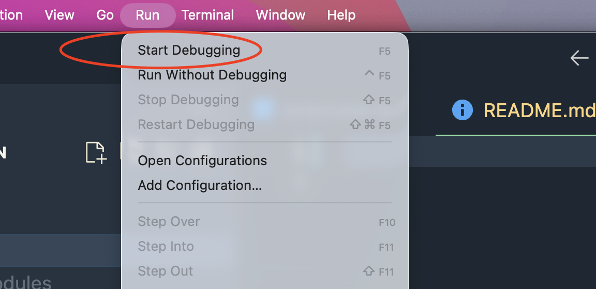
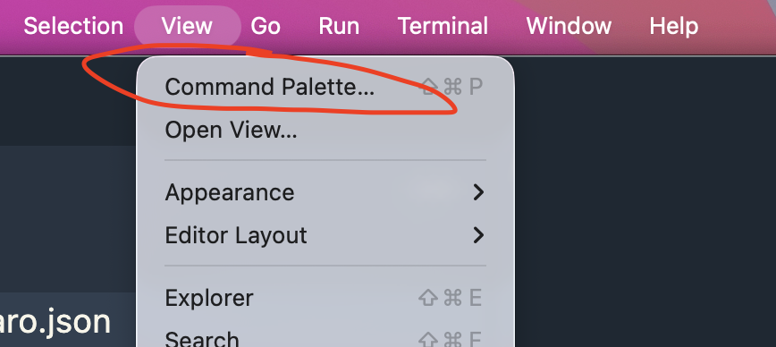

# ¿como ejecutar?

## Instalar dependencias

```
npm install
```

## Ejecutar

- primero abrir el archivo **./src/extension.ts** sobre ese archivo, ir a la opcion run/start debugging



- Abrir el command pallette



- escribir **d2c: Generate Screen from Figma** presionar enter

- preguntara por el node-id, escribir node-id
